# PRD — Student Information Management (SIM) Client

**Audience:** a frontend agent/developer building a web client against the SIM REST API in this repo.
**Source of truth:** the code (`routes/api.php`, `app/Http/Requests`, `app/Policies`, `app/Services`). Live OpenAPI docs: `GET /docs/api` (Swagger UI) and `GET /docs/api.json`.
**Read this first:** section 9 lists the remaining backend limitations. The five blocking gaps from the first draft (rooms, instructor lookup, offering roster with grades, `student_id` on `/auth/me`, term deadlines) are now resolved and documented below.

---

## 1. Product overview

SIM manages the academic lifecycle of a school: academic terms, programs, courses, students, class sections (course offerings), enrollments, and grades. Four roles use it:

| Role | Who | Core job in the client |
|---|---|---|
| `administrator` | System admin | Everything, including user accounts and correcting any grade |
| `registrar` | Records staff | Maintain academic data, enroll/drop students, view published grades |
| `instructor` | Teacher | See own classes, draft grades, publish them |
| `student` | Learner | See own profile, classes, published grades, academic record |

The API is the only backend. The client is a SPA/web app (no server rendering needed). Authentication is a bearer token (Laravel Sanctum).

### Goals
- Each role sees only the screens and actions it may use; the UI never offers an action the API will reject with 403.
- Every API error is surfaced to the user in a readable way (section 8).
- Business rules (capacity, deadlines, draft/publish locks) are explained in the UI, not just rejected.

### Non-goals
Payments, attendance, messaging, file uploads, real-time updates, registration/self sign-up, student self-enrollment (enrollment is staff-only).

---

## 2. API conventions (apply to every endpoint)

| Item | Value |
|---|---|
| Base URL | `{API_ORIGIN}/api/v1` (dev: `http://localhost:8000/api/v1`) |
| Headers | `Accept: application/json`, `Content-Type: application/json`, `Authorization: Bearer <token>` (all routes except the 5 public auth routes) |
| Dates / times | dates `YYYY-MM-DD`; times `HH:MM:SS` (24h); timestamps ISO 8601 |
| Booleans | real JSON booleans |
| IDs | integers |

### Response shapes

**Single resource** (`200`/`201`):
```json
{ "data": { "id": 1, "...": "..." }, "success": true, "message": "Student retrieved successfully." }
```

**List** (`200`) — always paginated:
```json
{
  "data": [ { "id": 1 } ],
  "links": { "first": "...", "last": "...", "prev": null, "next": "..." },
  "meta": { "current_page": 1, "from": 1, "last_page": 4, "per_page": 15, "to": 15, "total": 52, "path": "..." },
  "success": true,
  "message": "Students retrieved successfully."
}
```

**No content** (`204`, empty body): all `DELETE`s and `POST /auth/logout`.

**Error** (every non-2xx):
```json
{ "success": false, "message": "Validation failed.", "errors": { "email": ["The email has already been taken."] } }
```
`errors` is an object keyed by field **only for `422`**; for other statuses it is `[]` and `message` is the human text (e.g. `"Midterm grades are already published and can no longer be changed."`).

### Query parameters on list endpoints

| Param | Meaning |
|---|---|
| `page` | page number, default 1 |
| `per_page` | page size, default 15 |
| `sort` | comma-separated columns, `-` prefix = descending, e.g. `-year_level,last_name`. **Only sort by columns that exist on the resource**; an unknown column causes a `500` |
| `search` | text search (fields per resource below) |
| filters | exact-match query params per resource below |

Nested routes (`/students/{id}/...`, `/course-offerings/{id}/students`) support only `page` and `per_page`. `/users` supports only pagination.

### Status codes and what the client should do

| Code | Meaning | Client behavior |
|---|---|---|
| 200 / 201 / 204 | success | |
| 401 | missing/invalid/revoked token | clear stored token, redirect to login |
| 403 | role not allowed, object not yours, or a business lock (published grade, deadline passed) | show `message`; do not retry |
| 404 | record not found | show "not found" state |
| 409 | conflict, e.g. deleting a record that has dependants | show `message` |
| 422 | validation failed | map `errors[field]` onto form fields |
| 429 | rate limited (login, forgot/reset: 6 per minute) | tell the user to wait |
| 500 | server error | generic error, no details |

### Auth routes are throttled
`POST /auth/login`, `/auth/forgot-password`, `/auth/reset-password`: 6 requests/minute per client.

---

## 3. Roles and permissions

`GET /auth/me` returns the user's `role`; drive all role-based UI from it. Authorization is always enforced server-side; the client hides what the user cannot do.

| Capability | Admin | Registrar | Instructor | Student |
|---|---|---|---|---|
| Manage users (`/users`) | ✅ | ❌ | ❌ | ❌ |
| Programs, courses, academic terms: list/view/create/edit/delete | ✅ | ✅ | ❌ | ❌ |
| Update grading deadlines | ✅ | ✅ | ❌ | ❌ |
| Students: list/create/edit/delete | ✅ | ✅ | ❌ | ❌ |
| View a student profile | any | any | ❌ | **own only** |
| `/students/{id}/enrollments`, `/grades`, `/academic-record` | any | any | ❌ | **own only** |
| Course offerings: create/edit/delete | ✅ | ✅ | ❌ | ❌ |
| Course offerings: list | all | all | **own only** (auto-filtered) | ❌ |
| Course offering: view one | any | any | own | only if enrolled in it |
| Offering roster (`/course-offerings/{id}/students`) | any | any | own offering | ❌ |
| Offering enrollments + grades (`/course-offerings/{id}/enrollments`) | any (drafts visible) | any (published grades only, otherwise `grade: null`) | own offering (drafts visible) | ❌ |
| Look up rooms (`/rooms`) and instructors (`/instructors`) | ✅ | ✅ | ❌ | ❌ |
| Enrollments: create/edit/delete, list all | ✅ | ✅ | ❌ | ❌ |
| View one enrollment | any | any | in own offering | own |
| Grades: list all | ✅ | ✅ (published only) | ❌ | ❌ |
| Grade: view one | any (incl. drafts) | published only | own offering (incl. drafts) | own, published only |
| Grade: create (draft) | ✅ | ❌ | own offering | ❌ |
| Grade: edit | ✅ always | ❌ | own offering, **only while that period is a draft** (+2 exceptions, section 5.9) | ❌ |
| Grade: publish | ✅ | ❌ | own offering | ❌ |
| Bypass grading deadlines | ✅ | n/a | ❌ | n/a |
| Own account (`/auth/me`, edit name/email) | ✅ | ✅ | ✅ | ✅ |

Students get `403` on `/programs`, `/courses`, `/academic-terms` and `/course-offerings` (list). Do not show those screens to students.

---

## 4. Data model (what the client receives)

### Enumerations
| Field | Values |
|---|---|
| `users.role` | `administrator`, `registrar`, `instructor`, `student` |
| `users.status`, `programs.status`, `courses.status`, `academic_terms.status` | `active`, `inactive` |
| `students.status` | `regular`, `irregular`, `extendee` |
| `students.year_level` | integer 1–4 |
| `academic_terms.term` | `First Semester`, `Second Semester`, `MidYear` |
| `course_offerings.status` | `open`, `closed`, `cancelled` |
| `enrollments.status` | `enrolled`, `dropped`, `completed` |
| `grades.midterm_status`, `grades.final_status` | `draft`, `published` |
| `grades.remarks` | `Passed`, `Failed`, `Conditional`, `Incomplete`, `Withdrawn` (server-generated, read-only) |
| `courses.units` | integer 1–9 |

### Entities (response fields)

- **User** — `id, name, email, role, status, created_at, updated_at`
- **Program** — `id, code, name, description, status, created_at, updated_at`
- **Course** — `id, course_code, course_title, description, units, status, created_at, updated_at`
- **AcademicTerm** — `id, academic_year ("2024-2025"), term, start_date, end_date, status, midterm_grading_deadline (ISO datetime|null), final_grading_deadline (ISO datetime|null), inc_completion_deadline (date|null), created_at, updated_at`
- **Student** — `id, student_number, first_name, middle_name, last_name, suffix, birth_date, email, contact_number, address, program_id, year_level, status, created_at, updated_at`
- **CourseOffering** — `id, course_id, academic_term_id, instructor_id, section, capacity, status, schedules[], created_at, updated_at`, where each schedule is `{ id, room_id, day_of_week, start_time, end_time }`
- **Enrollment** — `id, student_id, course_offering_id, enrollment_date, status, created_at, updated_at`
- **Grade** — `id, enrollment_id, midterm_raw_score, midterm_equivalent_grade, finalterm_raw_score, finalterm_equivalent_grade, final_raw_score, final_equivalent_grade, re_exam_raw_score, re_exam_equivalent_grade, remarks, is_inc, inc_expiration_date, midterm_status, midterm_published_at, final_status, final_published_at, created_at, updated_at`. For students/registrars, fields of an unpublished period are **absent** from the JSON (not null) — render "not yet released".
- **Room** — `id, code, building, capacity` (read-only lookup via `GET /rooms`)

### Relationships
Program 1—N Student. Course 1—N CourseOffering. AcademicTerm 1—N CourseOffering. Instructor (User) 1—N CourseOffering. CourseOffering 1—N Schedule. Student 1—N Enrollment. CourseOffering 1—N Enrollment. Enrollment 1—1 Grade. Student N—1 User (a login account).

---

## 5. Functional requirements

IDs are stable references (e.g. in tickets). "UI" lines are client requirements.

### 5.1 Authentication and account (FR-AUTH)

| ID | Endpoint | Auth | Request | Response |
|---|---|---|---|---|
| FR-AUTH-1 | `POST /auth/login` | public | `{ email, password }` | `200 { success, message:"Login successful.", data:{ token } }` |
| FR-AUTH-2 | `POST /auth/logout` | token | – | `204`; the token is revoked |
| FR-AUTH-3 | `GET /auth/me` | token | – | `200 data: User`. For `student` accounts the user also has `student_id` (the id to use in `/students/{id}/...`; `null` if the account has no student record). Other roles do not get the key |
| FR-AUTH-4 | `PATCH /auth/me` | token | `{ name?, email? }` (role/status/password cannot be changed here) | `200 data: User` |
| FR-AUTH-5 | `POST /auth/forgot-password` | public | `{ email }` | always `200` with the same message, whether or not the email exists |
| FR-AUTH-6 | `POST /auth/reset-password` | public | `{ token, email, password, password_confirmation }` (password min 8) | `200`; all the user's tokens are revoked, so log in again |

Rules and UI:
- Wrong email, wrong password and inactive account all return the **same** `422` on `errors.email` — show one generic "Invalid credentials" message.
- Store the token (memory + `sessionStorage`/secure storage), attach it to every request, call `/auth/me` on app start to restore the session, and on any `401` clear it and go to login.
- Password reset email links to `{FRONTEND_URL}/reset-password?token=...&email=...` (default `http://localhost:3000`). The client **must** implement a `/reset-password` route that reads `token` and `email` from the query string and posts to FR-AUTH-6. In dev the email is only written to `storage/logs/laravel.log`.
- Changing email via FR-AUTH-4 also updates the linked student record's email.

### 5.2 Users (FR-USER) — administrator only

| ID | Endpoint | Notes |
|---|---|---|
| FR-USER-1 | `GET /users` | paginated, no search/filter |
| FR-USER-2 | `POST /users` | `{ name, email (unique), password (min 8), role, status }` all required |
| FR-USER-3 | `GET /users/{id}` | |
| FR-USER-4 | `PUT/PATCH /users/{id}` | all fields optional (`sometimes`) |
| FR-USER-5 | `DELETE /users/{id}` | |

UI: needed to create instructor/registrar/admin accounts. Student accounts are created automatically with the student (FR-STU-2).

### 5.3 Programs (FR-PROG) — admin, registrar

`GET /programs` (search: `name`, `code`; filter: `status`), `POST`, `GET/PUT/PATCH/DELETE /programs/{id}`.
Create: `code` (required, unique), `name` (required), `description?`, `status?` (default `active`).
Delete → `409` if the program has students.

### 5.4 Courses (FR-COURSE) — admin, registrar

`GET /courses` (search: `course_title`, `course_code`; filter: `status`), `POST`, `GET/PUT/PATCH/DELETE /courses/{id}`.
Create: `course_code` (required, unique), `course_title` (required), `description?`, `units` (required, int 1–9), `status?`.
Delete → `409` if used by a course offering.

### 5.5 Academic terms (FR-TERM) — admin, registrar

`GET /academic-terms` (search: `academic_year`; filters: `status`, `academic_year`, `term`), `POST`, `GET/PUT/PATCH/DELETE /academic-terms/{id}`.
Create: `academic_year` (`YYYY-YYYY`, consecutive years, e.g. `2024-2025`), `term` (enum), `start_date`, `end_date` (`YYYY-MM-DD`, end after start), `status?`. The pair `(academic_year, term)` must be unique.
Update accepts partial bodies (`PATCH {"status":"inactive"}` works).
Delete → `409` if the term has course offerings.

**FR-TERM-DL: grading deadlines** — `PATCH /academic-terms/{id}/grading-deadlines` (admin, registrar)
Body (all optional, but each later date must be on/after the earlier one): `midterm_grading_deadline`, `final_grading_deadline`, `inc_completion_deadline` (dates/datetimes).
Term responses (`GET`/list/`PATCH`) include the three deadline fields, so the grading UI can show them and disable inputs after a deadline.
UI: a "Grading deadlines" form on the term screen.

### 5.6 Students (FR-STU) — admin, registrar (student: own profile)

| ID | Endpoint | Notes |
|---|---|---|
| FR-STU-1 | `GET /students` | search: `first_name`, `last_name`, `student_number`; filters: `status`, `program_id`, `year_level`; staff only |
| FR-STU-2 | `POST /students` | creates the student **and a login account** (role `student`, same email); see below |
| FR-STU-3 | `GET /students/{id}` | staff: any; student: own |
| FR-STU-4 | `PUT/PATCH /students/{id}` | partial allowed; uniqueness ignores the record itself |
| FR-STU-5 | `DELETE /students/{id}` | `409` if the student has any enrollment |

Create fields: `student_number` (required, unique), `first_name`, `last_name` (required), `middle_name?`, `suffix?`, `birth_date` (required, past date), `email` (required, valid, unique), `contact_number` (required, unique), `address?`, `program_id` (required, existing), `year_level` (required, 1–4), `status?`.

UI: program dropdown from `GET /programs`. After creating a student, tell staff the student must use **Forgot password** to set their own password (the account is created with a default dev password).

### 5.7 Course offerings (FR-OFF) — admin, registrar (instructor: own, read)

| ID | Endpoint | Notes |
|---|---|---|
| FR-OFF-1 | `GET /course-offerings` | search: course title/code; filters: `status`, `course_id`, `academic_term_id`, `instructor_id`. Instructors automatically get only their own |
| FR-OFF-2 | `POST /course-offerings` | see below |
| FR-OFF-3 | `GET /course-offerings/{id}` | |
| FR-OFF-4 | `PUT/PATCH /course-offerings/{id}` | **`course_id` and `academic_term_id` cannot change** (delete and recreate instead) |
| FR-OFF-5 | `DELETE /course-offerings/{id}` | `409` if anyone ever enrolled |
| FR-OFF-6 | `GET /course-offerings/{id}/students` | plain student list for the offering (instructor own, staff any) |
| FR-OFF-7 | `GET /course-offerings/{id}/enrollments` | **grading-sheet roster**: every enrollment (all statuses) with `student` (`id, student_number, first_name, middle_name, last_name, suffix, program_id, year_level`) and `grade` (full grade incl. drafts for the instructor/admin; for the registrar `null` until a period is published; `null` when no grade exists yet). Params: `search` (student number, first/last name), `status`, `sort`, `page`, `per_page` (use one large enough for a whole class). Instructor: own offering only; staff: any |
| FR-ROOM-1 | `GET /rooms`, `GET /rooms/{id}` | staff only. Fields `id, code, building, capacity`; `search` (code, building), `building`, `sort`, pagination. Use it for the schedule `room_id` picker. Read-only |
| FR-INSTR-1 | `GET /instructors` | staff only (admin, registrar). Instructor accounts only, fields `id, name, email, status`; `search` (name, email), `status`, `sort`, pagination. Use `status=active` for the `instructor_id` picker |

Create body:
```json
{
  "course_id": 3, "academic_term_id": 2, "instructor_id": 7,
  "section": "A1", "capacity": 40, "status": "open",
  "schedules": [
    { "room_id": 1, "day_of_week": "Monday",    "start_time": "09:00:00", "end_time": "10:30:00" },
    { "room_id": 2, "day_of_week": "Wednesday", "start_time": "09:00:00", "end_time": "10:30:00" }
  ]
}
```
Rules the form must reflect:
- Pick `room_id` from `GET /rooms` and `instructor_id` from `GET /instructors?status=active`.
- The term must be `active`.
- `section` is unique per (course, term).
- At least one schedule; `end_time` after `start_time` in each; `day_of_week` is a string (use `Monday`…`Friday`/`Saturday`).
- No conflicts: same room overlapping on the same day in the same term; same instructor overlapping on the same day in the same term; overlaps inside the submitted list. Errors come back on `schedules`.
- On update, `capacity` cannot go below the number of currently `enrolled` students.

### 5.8 Enrollments (FR-ENR) — admin, registrar (instructor/student: view limited)

| ID | Endpoint | Notes |
|---|---|---|
| FR-ENR-1 | `GET /enrollments` | search: `student_number`; filters: `status`, `student_id`, `course_offering_id`; staff only |
| FR-ENR-2 | `POST /enrollments` | `{ student_id, course_offering_id, enrollment_date, status? }` |
| FR-ENR-3 | `GET /enrollments/{id}` | staff any; instructor if in own offering; student own |
| FR-ENR-4 | `PATCH /enrollments/{id}` | `{ enrollment_date?, status? }` — **this is how a class is dropped** (`status: "dropped"`) |
| FR-ENR-5 | `DELETE /enrollments/{id}` | hard delete, only to fix clerical errors; `409` if `completed` |
| FR-ENR-6 | `GET /students/{id}/enrollments` | staff any, student own |

Create rules: no duplicate (student, offering); offering `status` must be `open`; offering must have a free seat (only `enrolled` students use seats; `dropped`/`completed` do not); `enrollment_date` on/after the term's `start_date`.
Dropping side effects (server-side, show a confirmation): the student's scores are cleared and the grade becomes `Withdrawn` (or `Failed`/5.0 if dropped after the midterm deadline while failing), and that result is published immediately.

### 5.9 Grades (FR-GRADE) — the draft → publish workflow

Instructors enter **raw scores only**; the server computes equivalent grades, the final score and `remarks`. Never send equivalents or remarks.

| ID | Endpoint | Who | Notes |
|---|---|---|---|
| FR-GRADE-1 | `POST /grades` | instructor (own offering), admin | `{ enrollment_id, midterm_raw_score?, finalterm_raw_score?, re_exam_raw_score?, is_inc? }` → `201`, created as a draft |
| FR-GRADE-2 | `PATCH /grades/{id}` | instructor (own, draft only), admin | same fields, all optional |
| FR-GRADE-3 | `PUT /course-offerings/{id}/grades` | instructor (own), admin | bulk save: `{ "grades": [ { enrollment_id, midterm_raw_score?, finalterm_raw_score?, re_exam_raw_score?, is_inc? } ] }`; transactional — one bad row rejects all (`422`/`403`) |
| FR-GRADE-4 | `POST /grades/{id}/publish` | instructor (own), admin | `{ "period": "midterm" \| "final" }` → grade |
| FR-GRADE-5 | `POST /course-offerings/{id}/grades/publish` | instructor (own), admin | `{ "period": ... }` → `data: { period, published, skipped }` |
| FR-GRADE-6 | `GET /grades`, `GET /grades/{id}` | see section 3 | list search: `student_number`; filters: `is_inc`, `enrollment_id` |
| FR-GRADE-7 | `GET /students/{id}/grades` | staff any, student own | published periods only for non-admins |

Score rules: each raw score is a number 0–100. `finalterm_raw_score` requires a midterm score. `re_exam_raw_score` requires both scores and a final equivalent of exactly `4.0` (Conditional). Final score = ⅓ midterm + ⅔ finalterm.

Server-computed `remarks`: equivalent 1.0–3.0 → `Passed`; 4.0 → `Conditional`; 5.0 → `Failed`; `is_inc` → `Incomplete`; dropped → `Withdrawn`.
Re-exam: raw ≥ 50 → equivalent 3.0 (Passed); otherwise 5.0 (Failed).
INC: `is_inc: true` copies the term's `inc_completion_deadline` to `inc_expiration_date`; a daily job turns an expired INC into 5.0 `Failed`.

Draft/publish rules (the UI must model these):
- A grade has two independent periods: **midterm** (`midterm_status`) and **final** (`final_status`; covers finalterm, final, re-exam, INC, remarks).
- **Draft** → instructor edits freely; only that instructor and admins can see it.
- **Publish** → the student and registrar can now see that period, and the instructor can no longer change it. Only an admin can.
- Publishing needs: midterm → a midterm score; final → a finalterm score (or `is_inc`) **and** a midterm score. Bulk publish releases what qualifies and reports `skipped` for the rest (publish again later). Single publish with nothing to publish → `422`.
- Instructor exceptions after publishing: (a) enter `re_exam_raw_score` **once** on a published Conditional grade; (b) complete a published INC grade by sending the missing score(s) and `is_inc: false` (until `inc_completion_deadline`).
- Resending the same value for a locked field is fine; changing it returns `403`.
- Deadlines (instructors only; admins exempt): saving a midterm score after `midterm_grading_deadline`, a finalterm score after `final_grading_deadline`, or publishing a period after its deadline → `403`.
- Grades can only be saved for `enrolled` enrollments.

UI: a grading sheet per offering with a Draft/Published badge per period, inputs disabled for published periods, a "Save drafts" button (FR-GRADE-3) and "Publish midterm" / "Publish final" buttons (FR-GRADE-5) with the `published`/`skipped` result shown. `remarks` and equivalents are read-only. Students see "Not yet released" for absent fields.

### 5.10 Academic record (FR-REC)

`GET /students/{id}/academic-record` — staff any, student own. Not paginated, no params.
```json
{ "success": true, "message": "Academic record retrieved successfully.",
  "data": [ { "academic_term": "2024-2025 First Semester",
              "enrollments": [ { "course_code": "CS101", "course_title": "Intro", "units": 3,
                                 "final_equivalent_grade": 1.5, "remarks": "Passed" } ] } ] }
```
Only **published finals** count; otherwise `final_equivalent_grade` is `null` and `remarks` is `Ongoing` (or `Withdrawn` if dropped). UI: a transcript-style view grouped by term; optionally compute units per term and a GPA client-side from published rows.

---

## 6. Business process flows

### 6.1 Academic year setup (registrar)
1. Create the term — `POST /academic-terms` (status `active`).
2. Set grading deadlines — `PATCH /academic-terms/{id}/grading-deadlines`.
3. Ensure programs and courses exist — `POST /programs`, `POST /courses`.
4. Create sections — `POST /course-offerings` (needs an `active` term; resolve conflicts on `422`).

### 6.2 Student onboarding (registrar)
1. `POST /students` → also creates the login account (role `student`, email = student email).
2. The student opens the client → **Forgot password** → reset link → sets own password → logs in.

### 6.3 Enrollment and drop (registrar)
```
find student → find open offering (capacity left) → POST /enrollments (status enrolled)
   ├─ errors: duplicate, offering not open, full, date before term start
   └─ to drop: PATCH /enrollments/{id} { status: "dropped" }  → grade becomes Withdrawn/Failed (published)
```
Enrollment states: `enrolled → dropped` (staff) and `enrolled → completed` (staff, at term end). `completed` enrollments cannot be hard-deleted.

### 6.4 Grading lifecycle (instructor, admin overrides)

```mermaid
stateDiagram-v2
    [*] --> Draft: POST /grades or bulk save
    Draft --> Draft: edit scores (instructor)
    Draft --> MidtermPublished: publish midterm
    MidtermPublished --> FinalPublished: publish final
    Draft --> FinalPublished: publish final (needs midterm score)
    FinalPublished --> FinalPublished: re-exam (once, if Conditional) / INC completion (instructor)
    note right of FinalPublished: a published period never returns to draft; only an administrator can change anything else
```

Step by step:
1. Instructor opens own offering → `GET /course-offerings/{id}/enrollments?per_page=100` (FR-OFF-7) to get enrollment ids, students and current draft/published grades.
2. Enters midterm scores → **Save drafts** (`PUT /course-offerings/{id}/grades`).
3. Before `midterm_grading_deadline` → **Publish midterm** (`POST .../grades/publish {period:"midterm"}`). Students now see midterm scores.
4. Enters finalterm scores → save → **Publish final** before `final_grading_deadline`. Students now see final grade and remarks.
5. Exceptions: a `Conditional` (4.0) student takes the removal exam → instructor `PATCH /grades/{id} { re_exam_raw_score }` once. An `Incomplete` student finishes → instructor `PATCH /grades/{id} { finalterm_raw_score, is_inc:false }` before `inc_completion_deadline`; otherwise a nightly job fails it.
6. Corrections to anything else → administrator edits (`PATCH /grades/{id}`); no deadline applies to admins.

### 6.5 Student self-service
Login → dashboard from `GET /auth/me` → my enrollments (`/students/{id}/enrollments`) → my grades (`/students/{id}/grades`, published only) → academic record. A student cannot enroll or drop; direct them to the registrar.

### 6.6 Account recovery
`Forgot password` (email) → generic success message → user opens emailed link → client `/reset-password?token&email` → `POST /auth/reset-password` → redirect to login.

---

## 7. Suggested client structure

### Screens by role
| Role | Screens |
|---|---|
| Public | Login, Forgot password, Reset password |
| All | Profile (view/edit name & email), Logout |
| Administrator | Users; plus everything the registrar has; grade correction |
| Registrar | Dashboard, Programs, Courses, Academic terms (+ grading deadlines), Students (list/create/edit/detail), Course offerings (list/create/edit, schedules), Enrollments (list, create, drop), Grades (read-only, published) |
| Instructor | My course offerings, grading sheet per offering (draft/publish), grade detail |
| Student | My profile, my enrollments, my grades, my academic record |

### Cross-cutting requirements
- Route guards by `role`; unknown role → logout.
- One API client module: base URL from env, bearer header, `Accept: application/json`, central handling of `401` (logout), `422` (field errors), `403/409` (toast with `message`).
- Reusable paginated table (page, per_page, sort, search, filters bound to the query params above).
- Form components map `422 errors` to inputs; show enum values as dropdowns (section 4).
- Confirm dialogs for drop enrollment, delete, publish (publishing is irreversible for instructors).
- Cache lookup lists (programs, courses, terms) for the session; they are needed to display names because list responses contain IDs only (section 9).

---

## 8. Error and edge-case handling cheat sheet

| Situation | API result | UI |
|---|---|---|
| Token expired/revoked | 401 | back to login |
| Student opens `/programs` | 403 | never link to it |
| Instructor edits a published grade | 403 "…already published…" | disable inputs; show lock icon |
| Grading deadline passed | 403 "…deadline has passed." | show deadline, disable save/publish (admin excepted) |
| Delete program/course/term/student/offering in use | 409 | explain why it cannot be deleted |
| Duplicate student number/email/contact | 422 on that field | inline error |
| Enroll into full/closed offering | 422 | explain; suggest another section |
| Schedule conflict | 422 on `schedules` | show the conflict message |
| Publish with nothing to publish (single) | 422 | tell user which score is missing |
| Bulk publish partial | 200 with `skipped > 0` | "N published, M skipped (missing scores)" |
| Reset/forgot too often | 429 | wait message |

---

## 9. Backend gaps the client must know about

Verified against the current code. The five gaps that blocked screens in the first draft were closed:

- ~~No `GET /rooms`~~ → FR-ROOM-1.
- ~~Registrar cannot list instructors~~ → FR-INSTR-1 (`/users` stays admin-only).
- ~~Instructor cannot fetch enrollments and grades of their offering~~ → FR-OFF-7.
- ~~Student client cannot find its own `student_id`~~ → `student_id` on `/auth/me` (FR-AUTH-3).
- ~~Term responses omit the grading deadlines~~ → now included (FR-TERM-DL).

Remaining limitations:

1. **List responses contain IDs only** (offering → no course title/instructor name; enrollment → no student name; grade → no student). Until the API embeds or `include`s them, fetch lookups and join client-side.
2. **Docs vs code:** older docs mention year levels 1–6 and a `Summer` term; the code enforces **1–4** and `MidYear`. Use the values in section 4.
3. **Demo account `student@gmail.com` has no student record**, so it cannot view anything. Use a student created by the seeder (it has its own login) or create one via `POST /students` and use forgot-password.
4. **`sort` accepts any column name**; stick to the resource's own columns or the API returns `500`.
5. **Default password for new student accounts is a fixed dev value**; production needs a different onboarding mechanism (planned: random password / emailed reset link).

---

## 10. Development environment

- Start API: `php artisan serve` → `http://localhost:8000` (Swagger UI at `/docs/api`).
- Reset data: `php artisan migrate:fresh --seed` (150 grades, ~150 students, 40 offerings, 300 enrollments; a few grades are intentionally left as drafts).
- Dev accounts (password `password` for all, **development only**): `admin@gmail.com`, `registrar@gmail.com`, `instructor@gmail.com`, `student@gmail.com` (see limitation 3 in section 9). Extra instructors/registrars/students have random emails — query the DB or log in as admin and open `/users`.
- CORS: configured in `config/cors.php`; set the client origin there for browser calls.
- Mail: `MAIL_MAILER=log` — reset links appear in `storage/logs/laravel.log`.
- Tests: `php artisan test` (7 known failing `*_sort_results_by_multiple_columns` tests that log in without a role).

---

## 11. Acceptance checklist for the client

- [ ] Login, logout, session restore, forgot/reset password work; `401` returns to login.
- [ ] Menus and routes differ by role exactly as in section 3; students never see catalog screens.
- [ ] Registrar can create a term, set deadlines, program, course, section (room and instructor pickers from `/rooms` and `/instructors`), student, enrollment, and drop an enrollment.
- [ ] Every list has pagination, sorting, search/filters from the documented params.
- [ ] Every `422` is shown on the right form field; every `403`/`409` shows the server message.
- [ ] Instructor grading sheet: save drafts, publish midterm/final, locked inputs after publishing, re-exam and INC exceptions, deadline messages.
- [ ] Student sees only published data and "not yet released" placeholders; academic record grouped by term.
- [ ] No client code sends `remarks`, equivalent grades, or `final_raw_score`.
